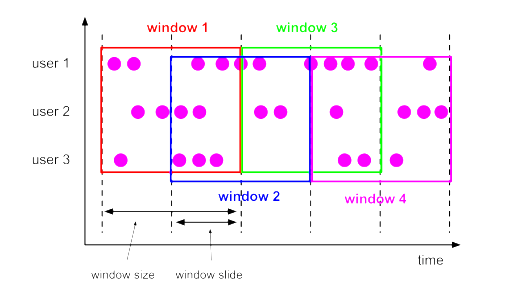

#  Flink 学习笔记


## 初识Flink

Flink起源于Stratosphere项目，Stratosphere是在2010~2014年由3所地处柏林的大学和欧洲的一些其他的大学共同进行的研究项目，2014年4月Stratosphere代码被复制并捐赠给了Apache软件基金会，参加这个孵化项目的初始成员是Stratosphere系统的核心开发人员，2014年12月，Flink一跃成为Apache软件基金会的顶级项目。

在德语中，Flink一词表示快速和灵巧，项目采用一只松鼠的彩色图案作为logo，这不仅是因为松鼠具有快速和灵巧的特点，还因为柏林的松鼠有一种迷人的红棕色，而 Flink 的松鼠logo拥有可爱的尾巴，尾巴的颜色与 Apache 软件基金会的 logo 颜色相呼应，也就是说，这是一只Apache风格的松鼠。


Flink 项目的理念是：“Apache Flink 是为分布式、高性能、随时可用以及准确的流处理应用程序打造的开源流处理框架”。Apache Flink 是一个框架和分布式处理引擎，用于对无界和有界数据流进行有状态计算。Flink 被设计在所有常见的集群环境中运行，以内存执行速度和任意规模来执行计算

-------------------------------------------------


## Flink 流处理Api

### 1. Source
#### 1.1 从集合读取数据
~~~ java
// 创建执行环境
StreamExecutionEnvironment env=StreamExecutionEnvironment.getExecutuionEnvironment();
// 从集合读取数据
DataStream<T> inputStream=env.fromCollection(Array.asList(new T(),new T(),new T()));

DataStream<Integer> integer = env.fromElements(1,2,3,4,5);
~~~
#### 1.2 从文件读取数据
~~~ java
// 创建执行环境
StreamExecutionEnvironment env=StreamExecutionEnvironment.getExecutuionEnvironment();
// 从文件读取数据
DataStream<String> inputStream=env.readTextFile("filePath");

DataStream<Integer> integer = env.readFile("filePath");
~~~

#### 1.3 从消息队列读取数据（kafka）
~~~ java
// 创建执行环境
StreamExecutionEnvironment env=StreamExecutionEnvironment.getExecutuionEnvironment();
// 从kafka读取数据
DataStream<String> inputStream=env.addSource(new FilnkKafkaConsumer())

DataStream<Integer> integer = env.readFile("filePath");
~~~

#### 1.4 自定义source
~~~ java
// 创建执行环境
StreamExecutionEnvironment env=StreamExecutionEnvironment.getExecutuionEnvironment();
// 从自定义source读取数据
DataStream<String> inputStream=env.addSource(new MySource())

//自定义source 
public static MySource() implements SourceFunction<T>{

    private runFlag=true;

    @Override
    public void run(SourceContext<T> ctx){
        while(runFlag){
            //生成自定义数据
            ctx.collect(new T);
        }

    }

    @Override
    public void cnacel(){
        runFlag=false;
    }
}
~~~

### 2. TransForm

#### 2.1 map 

~~~ java
// 输出字符串的长度
inputStream.map(new MapFunction<String,Integer>(){
    @Override
    public Integer map(String value){
        retunt value.length();
    }
});
~~~
#### 2.2 flatMap
~~~ java
// 按逗号分字段
inputStream.flatMap(new flatMapFunction<String,String>(){
    @Override
    public void flatMap(String value,Collector<String> out){
        for(String filed:value.split(",")){
            out.collect(filed);
        }
    }
});
~~~
#### 2.3 filter


~~~ java
// 筛选值大于三的数据
inputStream.filter(new filterFunction<Integer>(){
    @Override
    public boolen filter(Integer value){
        returm value > 3;
    }
});
~~~

#### 2.4 KeyBy


DataStream → KeyedStream：逻辑地将一个流拆分成不相交的分区，每个分
区包含具有相同 key 的元素，在内部以 hash 的形式实现的。

~~~ java
KeyedStream<T,Tuple> keyedStream= dataStream.keyBy("id");
KeyedStream<T,String> keyedStream= dataStream.keyBy(p->p.getId());

~~~

#### 2.5 滚动聚合算子
下面这些算子可以针对 KeyedStream 的每一个支流做聚合
* sum()
* min()
* max()
* minBy()
* maxBy()
  
~~~ java
DataStream<T> resultStream = keyedStream.max("temperature");
DataStream<T> resultStream = keyedStream.maxBy("temperature");
resultStream.print();
//max和maxBy的区别是  举例说明：以下是输入数据
SensorReading ss=new SensorReading("sensor_1", 1547718199L, 35.8);
new SensorReading("sensor_6", 1547718201L, 15.4);
new SensorReading("sensor_1", 1547718200L, 36.8);
new SensorReading("sensor_1", 1547718213L, 37.8);
new SensorReading("sensor_7", 1547718202L, 6.7);
new SensorReading("sensor_10", 1547718205L, 38.1);
//max结果是
new SensorReading("sensor_1", 1547718199L, 35.8);
new SensorReading("sensor_6", 1547718201L, 15.4);
new SensorReading("sensor_1", 1547718199L, 36.8);
new SensorReading("sensor_1", 1547718199L, 37.8);
new SensorReading("sensor_7", 1547718202L, 6.7);
new SensorReading("sensor_10", 1547718205L, 38.1);
//maxBy结果是
new SensorReading("sensor_1", 1547718199L, 35.8);
new SensorReading("sensor_6", 1547718201L, 15.4);
new SensorReading("sensor_1", 1547718200L, 36.8);
new SensorReading("sensor_1", 1547718213L, 37.8);
new SensorReading("sensor_7", 1547718202L, 6.7);
new SensorReading("sensor_10", 1547718205L, 38.1);
~~~

#### 2.6 Reduce
KeyedStream → DataStream：一个分组数据流的聚合操作，合并当前的元素
和上次聚合的结果，产生一个新的值，返回的流中包含每一次聚合的结果，而不是
只返回最后一次聚合的最终结果。

~~~ java
DataStream<String> inputStream = env.readTextFile("sensor.txt");
 // 转换成 SensorReading 类型
DataStream<SensorReading> dataStream = inputStream.map(new
    MapFunction<String, SensorReading>() {
        public SensorReading map(String value) throws Exception {
        String[] fileds = value.split(",");
        return new SensorReading(fileds[0], new Long(fileds[1]), new Double(fileds[2]));
    }
 });
 // 分组
 KeyedStream<SensorReading, Tuple> keyedStream = dataStream.keyBy("id");
 // reduce 聚合，取最小的温度值，并输出当前的时间戳
 DataStream<SensorReading> reduceStream = keyedStream.reduce(new
    ReduceFunction<SensorReading>() {
        // value1 是之前计算的值（flink有状态计算），value2是最新的传感器数据
        @Override
        public SensorReading reduce(SensorReading value1, SensorReading value2) throws Exception {
                return new SensorReading(value1.getId(),value2.getTimestamp(),Math.min(value1.getTemperature(), value2.getTemperature()));
    }
 });
~~~

#### 2.7 Split 和 Select

**split**


DataStream → SplitStream：根据某些特征把一个 DataStream 拆分成两个或者多个 DataStream。

**select**


SplitStream→DataStream：从一个 SplitStream 中获取一个或者多个DataStream。

需求：传感器数据按照温度高低（以 30 度为界），拆分成两个流。
~~~ java
SplitStream<SensorReading> splitStream = dataStream.split(new
OutputSelector<SensorReading>() {
 @Override
 public Iterable<String> select(SensorReading value) {
 return (value.getTemperature() > 30) ? Collections.singletonList("high") :
Collections.singletonList("low");
 }
});
DataStream<SensorReading> highTempStream = splitStream.select("high");
DataStream<SensorReading> lowTempStream = splitStream.select("low");
DataStream<SensorReading> allTempStream = splitStream.select("high", "low");
~~~


#### 2.8 Connect 和 CoMap

**connect**


DataStream,DataStream → ConnectedStreams：连接两个保持他们类型的数据流，两个数据流被 Connect 之后，只是被放在了一个同一个流中，内部依然保持各自的数据和形式不发生任何变化，两个流相互独立。


**comap  coflatMap**


ConnectedStreams → DataStream：作用于 ConnectedStreams 上，功能与 map和 flatMap 一样，对 ConnectedStreams 中的每一个 Stream 分别进行map 和 flatMap处理。


~~~ java
DataStream<Tuple2<String, Double>> warningStream = highTempStream.map(new
MapFunction<SensorReading, Tuple2<String, Double>>() {
 @Override
 public Tuple2<String, Double> map(SensorReading value) throws Exception {
 return new Tuple2<>(value.getId(), value.getTemperature());
 }
});
ConnectedStreams<Tuple2<String, Double>, SensorReading> connectedStreams = warningStream.connect(lowTempStream);
DataStream<Object> resultStream = connectedStreams.map(new
CoMapFunction<Tuple2<String,Double>, SensorReading, Object>() {
 @Override
 public Object map1(Tuple2<String, Double> value) throws Exception {
 return new Tuple3<>(value.f0, value.f1, "warning");
 }
 @Override
 public Object map2(SensorReading value) throws Exception {
 return new Tuple2<>(value.getId(), "healthy");
 }
});
~~~


#### 2.9 union


DataStream → DataStream：对两个或者两个以上的 DataStream 进行 union 操作，产生一个包含所有 DataStream 元素的新 DataStream。

~~~ java
DataStream<SensorReading> unionStream = highTempStream.union(lowTempStream);
~~~

Connect 与 Union 区别:
* Union 之前两个流的类型必须是一样，Connect 可以不一样，在之后的 coMap
中再去调整成为一样的。
* Connect 只能操作两个流，Union 可以操作多个。


### 3. 支持的数据类型

Flink 流应用程序处理的是以数据对象表示的事件流。所以在 Flink 内部，我们需要能够处理这些对象。它们需要被序列化和反序列化，以便通过网络传送它们；或者从状态后端、检查点和保存点读取它们。为了有效地做到这一点，Flink 需要明确知道应用程序所处理的数据类型。Flink 使用类型信息的概念来表示数据类型，并为每个数据类型生成特定的序列化器、反序列化器和比较器。Flink 还具有一个类型提取系统，该系统分析函数的输入和返回类型，以自动获取类型信息，从而获得序列化器和反序列化器。但是，在某些情况下，例如 lambda函数或泛型类型，需要显式地提供类型信息，才能使应用程序正常工作或提高其性能。

Flink 支持 Java 和 Scala 中所有常见数据类型。使用最广泛的类型有以下几种。

#### 3.1 基础数据类型

~~~ java
DataStream<Integer> numberStream = env.fromElements(1, 2, 3, 4);
numberStream.map(data -> data * 2);
~~~

#### 3.2 Java 和 Scala 元组（Tuples）

~~~ java
DataStream<Tuple2<String, Integer>> personStream = env.fromElements(
 new Tuple2("Adam", 17),
 new Tuple2("Sarah", 23) );
personStream.filter(p -> p.f1 > 18);
~~~
#### 3.3 Scala 样例类（case classes）
~~~ scala
case class Person(name: String, age: Int)
val persons: DataStream[Person] = env.fromElements(
Person("Adam", 17),
Person("Sarah", 23) )
persons.filter(p => p.age > 18)
~~~

#### 3.4 Java 简单对象（POJOs）
~~~ java
public class Person {
public String name;
public int age;
 public Person() {}
 public Person(String name, int age) { 
this.name = name; 
this.age = age; 
}
}
DataStream<Person> persons = env.fromElements( 
new Person("Alex", 42), 
new Person("Wendy", 23));
~~~

#### 3.5  其它（Arrays, Lists, Maps, Enums, 等等）

Flink 对 Java 和 Scala 中的一些特殊目的的类型也都是支持的，比如 Java 的ArrayList，HashMap，Enum 等等。


### 4 . 实现 UDF 函数——更细粒度的控制流

#### 4.1 实现 UDF 函数——更细粒度的控制

Flink 暴露了所有 udf 函数的接口(实现方式为接口或者抽象类)。例如
MapFunction, FilterFunction, ProcessFunction 等等。
下面例子实现了 FilterFunction 接口：

~~~ java
DataStream<String> flinkTweets = tweets.filter(new FlinkFilter());
public static class FlinkFilter implements FilterFunction<String> {
 @Override
 public boolean filter(String value) throws Exception {
 return value.contains("flink");
    }
}
~~~

还可以将函数实现成匿名类
~~~ java
DataStream<String> flinkTweets = tweets.filter(new FilterFunction<String>() {
 @Override
 public boolean filter(String value) throws Exception {
 return value.contains("flink");
 }
});
~~~
我们 filter 的字符串"flink"还可以当作参数传进去。
~~~ java
DataStream<String> tweets = env.readTextFile("INPUT_FILE ");
DataStream<String> flinkTweets = tweets.filter(new KeyWordFilter("flink"));
public static class KeyWordFilter implements FilterFunction<String> {
 private String keyWord;
 KeyWordFilter(String keyWord) { this.keyWord = keyWord; }
 @Override
 public boolean filter(String value) throws Exception {
 return value.contains(this.keyWord);
 }
}

~~~

#### 4.2  匿名函数（Lambda Functions）

~~~ java
DataStream<String> tweets = env.readTextFile("INPUT_FILE");
DataStream<String> flinkTweets = tweets.filter( tweet -> tweet.contains("flink") );

~~~

#### 4.3 富函数（Rich Functions）

“富函数”是 DataStream API 提供的一个函数类的接口，所有 Flink 函数类都有其 Rich 版本。它与常规函数的不同在于，可以获取运行环境的上下文，并拥有一些生命周期方法，所以可以实现更复杂的功能。(后面会讲状态编程)
* RichMapFunction
* RichFlatMapFunction
* RichFilterFunction
* …
  

Rich Function 有一个生命周期的概念。典型的生命周期方法有：
* open()方法是 rich function 的初始化方法，当一个算子例如 map 或者 filter被调用之前 open()会被调用。
* close()方法是生命周期中的最后一个调用的方法，做一些清理工作。
* getRuntimeContext()方法提供了函数的 RuntimeContext 的一些信息，例如函数执行的并行度，任务的名字，以及 state 状态


~~~java
public static class MyMapFunction extends RichMapFunction<SensorReading, Tuple2<Integer, String>> {
 @Override
 public Tuple2<Integer, String> map(SensorReading value) throws Exception {
        return new Tuple2<>(getRuntimeContext().getIndexOfThisSubtask(), value.getId());
    }
 @Override
 public void open(Configuration parameters) throws Exception {
     System.out.println("my map open");
    // 以下可以做一些初始化工作，例如建立一个和 HDFS 的连接（每个分区执行一次）
    }
 @Override
 public void close() throws Exception {
    System.out.println("my map close");
 // 以下做一些清理工作，例如断开和 HDFS 的连接（每个分区执行一次）
    }
}

~~~


### 5. Sink
Flink 没有类似于 spark 中 foreach 方法，让用户进行迭代的操作。虽有对外的输出操作都要利用 Sink 完成。最后通过类似如下方式完成整个任务最终输出操作。

`stream.addSink(new MySink(xxxx)) `

官方提供了一部分的框架的 sink。除此以外，需要用户自定义实现sink。


#### 5.1 Kafka

```xml
<dependency>
 <groupId>org.apache.flink</groupId>
 <artifactId>flink-connector-kafka-0.11_2.12</artifactId>
 <version>1.10.1</version>
</dependency>
```


```java
dataStream.addSink(new FlinkKafkaProducer011[String]("localhost:9092", "test",new SimpleStringSchema()))
```

#### 5.2 Redis

```xml
<dependency>
 <groupId>org.apache.bahir</groupId>
 <artifactId>flink-connector-redis_2.11</artifactId>
 <version>1.0</version>
</dependency>
```
定义一个 redis 的 mapper 类，用于定义保存到 redis 时调用的命令：

```java
public static class MyRedisMapper implements RedisMapper<SensorReading>{
 // 保存到 redis 的命令，存成哈希表
 public RedisCommandDescription getCommandDescription() {
 return new RedisCommandDescription(RedisCommand.HSET, "sensor_tempe");
 }
 public String getKeyFromData(SensorReading data) {
 return data.getId();
 }
 public String getValueFromData(SensorReading data) {
 return data.getTemperature().toString();
 }
}
```

在主函数中调用：
```java
FlinkJedisPoolConfig config = new FlinkJedisPoolConfig.Builder()
 .setHost("localhost")
 .setPort(6379)
 .build();

 dataStream.addSink( new RedisSink<SensorReading>(config, new MyRedisMapper()) );

```

#### 5.3 Elasticsearch

```xml
<dependency>
 <groupId>org.apache.flink</groupId>
 <artifactId>flink-connector-elasticsearch6_2.12</artifactId>
 <version>1.10.1</version>
</dependency>
```

在主函数中调用：

```java
// es 的 httpHosts 配置
ArrayList<HttpHost> httpHosts = new ArrayList<>();
httpHosts.add(new HttpHost("localhost", 9200));
dataStream.addSink( new ElasticsearchSink.Builder<SensorReading>(httpHosts, new MyEsSinkFunction()).build());

```
ElasitcsearchSinkFunction 的实现

```java
public static class MyEsSinkFunction implements ElasticsearchSinkFunction<SensorReading>{
 @Override
 public void process(SensorReading element, RuntimeContext ctx, RequestIndexer indexer) {
    HashMap<String, String> dataSource = new HashMap<>();
    dataSource.put("id", element.getId());
    dataSource.put("ts", element.getTimestamp().toString());
    dataSource.put("temp", element.getTemperature().toString());
    IndexRequest indexRequest = Requests.indexRequest()
        .index("sensor")
        .type("readingData")
        .source(dataSource);
    indexer.add(indexRequest);
 }
}
```


#### 5.4 JDBC 自定义sink
```xml
<dependency>
 <groupId>mysql</groupId>
 <artifactId>mysql-connector-java</artifactId>
 <version>5.1.44</version>
</dependency
```

添加 MyJdbcSink

```java
public static class MyJdbcSink extends RichSinkFunction<SensorReading> {
    Connection conn = null;
    PreparedStatement insertStmt = null;
    PreparedStatement updateStmt = null;
    // open 主要是创建连接
    @Override
    public void open(Configuration parameters) throws Exception {
        conn = DriverManager.getConnection("jdbc:mysql://localhost:3306/test", "root", "123456");
        // 创建预编译器，有占位符，可传入参数
        insertStmt = conn.prepareStatement("INSERT INTO sensor_temp (id, temp) VALUES (?, ?)");
        updateStmt = conn.prepareStatement("UPDATE sensor_temp SET temp = ? WHERE id = ?");
    }
    // 调用连接，执行 sql
    @Override
    public void invoke(SensorReading value, Context context) throws Exception {
        // 执行更新语句，注意不要留 super
        updateStmt.setDouble(1, value.getTemperature());
        updateStmt.setString(2, value.getId());
        updateStmt.execute();
        // 如果刚才 update 语句没有更新，那么插入
        if (updateStmt.getUpdateCount() == 0) {
            insertStmt.setString(1, value.getId());
            insertStmt.setDouble(2, value.getTemperature());
            insertStmt.execute();
            }
    }
    @Override
    public void close() throws Exception {
    insertStmt.close();
    updateStmt.close();
    conn.close();
 }
}
```
在 main 方法中增加，把明细保存到 mysql 中
```java
dataStream.addSink(new MyJdbcSink())
```

### 6.Flink 中的 Window

 streaming 流式计算是一种被设计用于处理无限数据集的数据处理引擎，而无限数据集是指一种不断增长的本质上无限的数据集，而 window 是一种切割无限数据为有限块进行处理的手段。


Window 是无限数据流处理的核心，Window 将一个无限的 stream 拆分成有限大小的”buckets”桶，我们可以在这些桶上做计算操作。


Window 可以分成两类：
* CountWindow：按照指定的数据条数生成一个 Window，与时间无关。
    * 滚动计数窗口
    * 滑动计数窗口
* TimeWindow：按照时间生成 Window
    * 滚动时间窗口
    * 滑动时间窗口
    * 会话窗口


#### 6.1 滚动窗口（Tumbling Windows）不区分时间和计数

将数据依据固定的窗口长度对数据进行切片。

**特点：时间对齐，窗口长度固定，没有重叠。**

滚动窗口分配器将每个元素分配到一个指定窗口大小的窗口中，滚动窗口有一
个固定的大小，并且不会出现重叠。例如：如果你指定了一个 5 分钟大小的滚动窗
口，窗口的创建如下图所示：


#### 6.2 滑动窗口（Sliding Windows）

滑动窗口是固定窗口的更广义的一种形式，滑动窗口由固定的窗口长度和滑动间隔组成。

**特点：时间对齐，窗口长度固定，可以有重叠。**

滑动窗口分配器将元素分配到固定长度的窗口中，与滚动窗口类似，窗口的大小由窗口大小参数来配置，另一个窗口滑动参数控制滑动窗口开始的频率。因此，滑动窗口如果滑动参数小于窗口大小的话，窗口是可以重叠的，在这种情况下元素会被分配到多个窗口中

例如，你有 10 分钟的窗口和 5 分钟的滑动，那么每个窗口中 5 分钟的窗口里包
含着上个 10 分钟产生的数据，如下图所示：




#### 6.3 会话窗口（Session Windows）

由一系列事件组合一个指定时间长度的 timeout 间隙组成，类似于 web 应用的session，也就是一段时间没有接收到新数据就会生成新的窗口。

**特点：时间无对齐。**

session 窗口分配器通过 session 活动来对元素进行分组，session 窗口跟滚动窗口和滑动窗口相比，不会有重叠和固定的开始时间和结束时间的情况，相反，当它在一个固定的时间周期内不再收到元素，即非活动间隔产生，那个这个窗口就会关闭。一个 session 窗口通过一个 session 间隔来配置，这个session间隔定义了非活跃周期的长度，当这个非活跃周期产生，那么当前的 session 将关闭并且后续的元素将被分配到新的 session 窗口中去。


### 7. 处理函数


之前所介绍的流处理 API，无论是基本的转换、聚合，还是更为复杂的窗口操作，其实都是基于 DataStream 进行转换的；所以可以统称为 DataStream API，这也是 Flink 编程的核心。而我们知道，为了让代码有更强大的表现力和易用性，Flink 本身提供了多层 API，DataStream API 只是中间的一环，如图 所示：


在更底层，我们可以不定义任何具体的算子（比如 map，filter，或者 window），而只是提炼出一个统一的“处理”（process）操作——它是所有转换算子的一个概括性的表达，可以自定义处理逻辑，所以这一层接口就被叫作“处理函数”（process function）。


>处理函数是算子的大招-它可以实现其他基本算子做不到的功能。处理函数提供了一个“定时服务”（TimerService），我们可以通过它访问流中的事件（event）、时间戳（timestamp）、水位线（watermark），甚至可以注册“定时事件”。而且处理函数继承了 AbstractRichFunction 抽象类，所以拥有富函数类的所有特性，同样可以访问状态（state）和其他运行时信息。此外，处理函数还可以直接将数据输出到侧输出流（side output）中。所以，处理函数是最为灵活的处理方法，可以实现各种自定义的业务逻辑；同时也是整个 DataStream API 的底层基础。

#### 7.1 基本处理函数（ProcessFunction）

这里我们在 ProcessFunction 中重写了.processElement()方法，自定义了一种处理逻辑：当数据的 user 为“Mary”时，将其输出一次；而如果为“Bob”时，将 user 输出两次。这里的输 出 ， 是 通 过 调 用 out.collect() 来实现的。另外我们还可以调用ctx.timerService().currentWatermark() 来 获 取 当 前 的 水 位 线 打 印 输 出 。所 以 可 以 看 到 ，ProcessFunction 函数有点像 FlatMapFunction 的升级版。可以实现 Map、Filter、FlatMap 的所有功能。很明显，处理函数非常强大，能够做很多之前做不到的事情。

```java
public class ProcessFunctionExample {
    public static void main(String[] args) throws Exception {
        StreamExecutionEnvironment env = StreamExecutionEnvironment.getExecutionEnvironment();
        env.setParallelism(1);
        env.addSource(new ClickSource()).assignTimestampsAndWatermarks(WatermarkStrategy.<Event>forMonotonousTimestamps()
        .withTimestampAssigner(new SerializableTimestampAssigner<Event>() {
                @Override
                public long extractTimestamp(Event event, long l) {
                    return event.timestamp;
                }
            })).process(new ProcessFunction<Event, String>() {
                @Override
                public void processElement(Event value, Context ctx,
                    Collector<String> out) throws Exception {
                    if (value.user.equals("Mary")) {
                        out.collect(value.user);
                    } else if (value.user.equals("Bob")) {
                        out.collect(value.user);
                        out.collect(value.user);
                    }

                    System.out.println(ctx.timerService().currentWatermark());
                }
            }).print();
        env.execute();
    }
}

```

#### 7.2 按键分区处理函数（KeyedProcessFunction）

在 Flink 程序中，为了实现数据的聚合统计，或者开窗计算之类的功能，我们一般都要先用 keyBy 算子对数据流进行“按键分区”，得到一个 KeyedStream。也就是指定一个键（key），按照它的哈希值（hash code）将数据分成不同的“组”，然后分配到不同的并行子任务上执行计算；这相当于做了一个逻辑分流的操作，从而可以充分利用并行计算的优势实时处理海量数据。

另外我们在上节中也提到，只有在 KeyedStream 中才支持使用 TimerService 设置定时器的操作。所以一般情况下，我们都是先做了 keyBy 分区之后，再去定义处理操作；代码中更加常见的处理函数是 KeyedProcessFunction，最基本的ProcessFunction 反而出镜率没那么高。


处理时间定时器demo

```java
public class ProcessingTimeTimerTest
{
    public static void main(String[] args) throws Exception
    {
        StreamExecutionEnvironment env = StreamExecutionEnvironment.getExecutionEnvironment();
        env.setParallelism(1);
        // 处理时间语义，不需要分配时间戳和 watermark
        SingleOutputStreamOperator < Event > stream = env.addSource(new ClickSource());
        // 要用定时器，必须基于 KeyedStream
        stream.keyBy(data - > true).process(new KeyedProcessFunction < Boolean, Event, String > ()
        {
            @Override
            public void processElement(Event value, Context ctx, Collector < String > out) throws Exception
            {
                Long currTs = ctx.timerService().currentProcessingTime();
                out.collect("数据到达，到达时间：" + new Timestamp(currTs));
                // 注册一个 10 秒后的定时器
                ctx.timerService().registerProcessingTimeTimer(currTs + 10 * 1000 L);
            }
            @Override
            public void onTimer(long timestamp, OnTimerContext ctx, Collector < String > out) throws Exception
            {
                out.collect("定时器触发，触发时间：" + new Timestamp(timestamp));
            }
        }).print();
        env.execute();
    }
}

```


在上面的代码中，由于定时器只能在 KeyedStream 上使用，所以先要进行 keyBy；这里的.keyBy(data -> true)是将所有数据的 key都指定为了 true，其实就是所有数据拥有相同的 key，会分配到同一个分区。

之后我们自定义了一个 KeyedProcessFunction，其中.processElement()方法是每来一个数据都会调用一次，主要是定义了一个 10 秒之后的定时器；而.onTimer()方法则会在定时器触发时调用。所以我们会看到，程序运行后先在控制台输出“数据到达”的信息，等待 10 秒之后，又会输出“定时器触发”的信息，打印出的时间间隔正是 10 秒。

事件时间定时器demo
```java
public class EventTimeTimerTest
{
    public static void main(String[] args) throws Exception
        {
            StreamExecutionEnvironment env = StreamExecutionEnvironment.getExecutionEnvironment();
            env.setParallelism(1);
            SingleOutputStreamOperator < Event > stream = env.addSource(new CustomSource()).assignTimestampsAndWatermarks(WatermarkStrategy. < Event > forMonot onousTimestamps().withTimestampAssigner(new SerializableTimestampAssigner < Event > ()
            {
                @Override
                public long extractTimestamp(Event element, long recordTimestamp)
                {
                    return element.timestamp;
                }
            }));
            // 基于 KeyedStream 定义事件时间定时器
            stream.keyBy(data - > true).process(new KeyedProcessFunction < Boolean, Event, String > ()
            {
                @Override
                public void processElement(Event value, Context ctx, Collector < String > out) throws Exception
                {
                    out.collect("数据到达，时间戳为：" + ctx.timestamp());
                    out.collect(" 数据到达，水位线为： " + ctx.timerService().currentWatermark() + "\n -------分割线-------");
                    // 注册一个 10 秒后的定时器
                    ctx.timerService().registerEventTimeTimer(ctx.timestamp() + 10 * 1000 L);
                }
                @Override
                public void onTimer(long timestamp, OnTimerContext ctx, Collector < String > out) throws Exception
                {
                    out.collect("定时器触发，触发时间：" + timestamp);
                }
            }).print();
            env.execute();
        }
        // 自定义测试数据源
    public static class CustomSource implements SourceFunction < Event >
    {
        @Override
        public void run(SourceContext < Event > ctx) throws Exception
        {
            // 直接发出测试数据
            ctx.collect(new Event("Mary", "./home", 1000 L));
            // 为了更加明显，中间停顿 5 秒钟
            Thread.sleep(5000 L);
            // 发出 10 秒后的数据
            ctx.collect(new Event("Mary", "./home", 11000 L));
            Thread.sleep(5000 L);
            // 发出 10 秒+1ms 后的数据
            ctx.collect(new Event("Alice", "./cart", 11001 L));
            Thread.sleep(5000 L);
        }
        @Override
        public void cancel()
        {}
    }
}

```

输出结果如下：


每来一条数据，都会输出两行“数据到达”的信息，并以分割线隔开；两条数据到达的时
间间隔为 5 秒。当第三条数据到达后，随后立即输出一条定时器触发的信息；再过 5 秒之后，
剩余两条定时器信息输出，程序运行结束。

我们可以发现，数据到来之后，当前的水位线与时间戳并不是一致的。当第一条数据到来，
时间戳为 1000，可水位线的生成是周期性的（默认 200ms 一次），不会立即发生改变，所以依
然是最小值 Long.MIN_VALUE；随后只要到了水位线生成的时间点（200ms 到了），就会依据
当前的最大时间戳 1000 来生成水位线了。这里我们没有设置水位线延迟，默认需要减去 1 毫
秒，所以水位线推进到了 999。而当时间戳为 11000 的第二条数据到来之后，水位线同样没有
立即改变，仍然是 999，就好像总是“滞后”数据一样。

这样程序的行为就可以得到合理解释了。事件时间语义下，定时器触发的条件就是水位线
推进到设定的时间。第一条数据到来后，设定的定时器时间为 1000 + 10 * 1000 = 11000；而当
时间戳为 11000 的第二条数据到来，水位线还处在 999 的位置，当然不会立即触发定时器；而
之后水位线会推进到 10999，同样是无法触发定时器的。必须等到第三条数据到来，将水位线
真正推进到 11000，就可以触发第一个定时器了。第三条数据发出后再过 5 秒，没有更多的数
据生成了，整个程序运行结束将要退出，此时 Flink 会自动将水位线推进到长整型的最大值
（Long.MAX_VALUE）。于是所有尚未触发的定时器这时就统一触发了，我们就在控制台看到
了后两个定时器的触发信息。


#### 7.3 窗口处理函数


进行窗口计算，我们可以直接调用现成的简单聚合方法（sum/max/min）,也可以通过调
用.reduce()或.aggregate()来自定义一般的增量聚合函数（ReduceFunction/AggregateFucntion）；
而对于更加复杂、需要窗口信息和额外状态的一些场景，我们还可以直接使用全窗口函数、把
数据全部收集保存在窗口内，等到触发窗口计算时再统一处理。窗口处理函数就是一种典型的
全窗口函数。

窗 口 处 理 函 数 ProcessWindowFunction 的 使 用 与 其 他 窗 口 函 数 类 似 ， 也 是 基 于
WindowedStream 直接调用方法就可以，只不过这时调用的是.process()。

``` java
stream.keyBy( t -> t.f0 )
 .window( TumblingEventTimeWindows.of(Time.seconds(10)) )
 .process(new MyProcessWindowFunction())
```


#### 7.4 应用案例---Top N

窗口的计算处理，在实际应用中非常常见。对于一些比较复杂的需求，如果增量聚合函数
无法满足，我们就需要考虑使用窗口处理函数这样的“大招”了。

网站中一个非常经典的例子，就是实时统计一段时间内的热门 url。例如，需要统计最近
10 秒钟内最热门的两个 url 链接，并且每 5 秒钟更新一次。我们知道，这可以用一个滑动窗口
来实现，而“热门度”一般可以直接用访问量来表示。于是就需要开滑动窗口收集 url 的访问
数据，按照不同的 url 进行统计，而后汇总排序并最终输出前两名。这其实就是著名的“Top N”
问题。

很显然，简单的增量聚合可以得到 url 链接的访问量，但是后续的排序输出 Top N 就很难
实现了。所以接下来我们用窗口处理函数进行实现。

##### 7.4.1 使用 ProcessAllWindowFunction


一种最简单的想法是，我们干脆不区分 url 链接，而是将所有访问数据都收集起来，统一
进行统计计算。所以可以不做 keyBy，直接基于 DataStream 开窗，然后使用全窗口函数
ProcessAllWindowFunction 来进行处理。

```java
public class ProcessAllWindowTopN
{
    public static void main(String[] args) throws Exception
    {
        StreamExecutionEnvironment env = StreamExecutionEnvironment.getExecutionEnvironment();
        env.setParallelism(1);
        SingleOutputStreamOperator < Event > eventStream = env.addSource(new ClickSource()).assignTimestampsAndWatermarks(WatermarkStrategy. < Event > forMonotonousTimestamps().withTimestampAssigner(new SerializableTimestampAssigner < Event > ()
        {
            @Override
            public long extractTimestamp(Event element, long recordTimestamp)
            {
                return element.timestamp;
            }
        }));
        // 只需要 url 就可以统计数量，所以转换成 String 直接开窗统计
        SingleOutputStreamOperator < String > result = eventStream.map(new MapFunction < Event, String > ()
            {
                @Override
                public String map(Event value) throws Exception
                {
                    return value.url;
                }
            }).windowAll(SlidingEventTimeWindows.of(Time.seconds(10), Time.seconds(5))) // 开滑动窗口
            .process(new ProcessAllWindowFunction < String, String, TimeWindow > ()
            {
                @Override
                public void process(Context context, Iterable < String > elements, Collector < String > out) throws Exception
                {
                    HashMap < String, Long > urlCountMap = new HashMap < > ();
                    // 遍历窗口中数据，将浏览量保存到一个 HashMap 中
                    for(String url: elements)
                    {
                        if(urlCountMap.containsKey(url))
                        {
                            long count = urlCountMap.get(url);
                            urlCountMap.put(url, count + 1 L);
                        }
                        else
                        {
                            urlCountMap.put(url, 1 L);
                        }
                    }
                    ArrayList < Tuple2 < String, Long >> mapList = new
                    ArrayList < Tuple2 < String, Long >> ();
                    // 将浏览量数据放入 ArrayList，进行排序
                    for(String key: urlCountMap.keySet())
                    {
                        mapList.add(Tuple2.of(key, urlCountMap.get(key)));
                    }
                    mapList.sort(new Comparator < Tuple2 < String, Long >> ()
                    {
                        @Override
                        public int compare(Tuple2 < String, Long > o1, Tuple2 < String, Long > o2)
                        {
                            return o2.f1.intValue() - o1.f1.intValue();
                        }
                    });
                    // 取排序后的前两名，构建输出结果
                    StringBuilder result = new StringBuilder();
                    result.append("========================================\n");
                    for(int i = 0; i < 2; i++)
                    {
                        Tuple2 < String, Long > temp = mapList.get(i);
                        String info = "浏览量 No." + (i + 1) + " url：" + temp.f0 + " 浏览量：" + temp.f1 + " 窗 口 结 束 时 间 ： " + new
                        Timestamp(context.window().getEnd()) + "\n";
                        result.append(info);
                    }
                    result.append("========================================\n");
                    out.collect(result.toString());
                }
            });
        result.print();
        env.execute();
    }
}
```


##### 7.4.2 使用 KeyedProcessFunction 


直接将所有数据放在一个分区上进行
了开窗操作。这相当于将并行度强行设置为 1，在实际应用中是要尽量避免的，所以 Flink 官
方也并不推荐使用 AllWindowedStream 进行处理。另外，我们在全窗口函数中定义了 HashMap
来统计 url 链接的浏览量，计算过程是要先收集齐所有数据、然后再逐一遍历更新 HashMap，
这显然不够高效。如果我们可以利用增量聚合函数的特性，每来一条数据就更新一次对应 url
的浏览量，那么到窗口触发计算时只需要做排序输出就可以了。

基于这样的想法，我们可以从两个方面去做优化：一是对数据进行按键分区，分别统计浏
览量；二是进行增量聚合，得到结果最后再做排序输出。所以，我们可以使用增量聚合函数
AggregateFunction 进行浏览量的统计，然后结合 ProcessWindowFunction 排序输出来实现 Top N
的需求。

具体实现思路就是，先按照 url 对数据进行 keyBy 分区，然后开窗进行增量聚合。这里就
会发现一个问题：我们进行按键分区之后，窗口的计算就会只针对当前 key 有效了；也就是说，
每个窗口的统计结果中，只会有一个 url 的浏览量，这是无法直接用 ProcessWindowFunction
进行排序的。所以我们只能分成两步：先对每个 url 链接统计出浏览量，然后再将统计结果收
集起来，排序输出最终结果。因为最后的排序还是基于每个时间窗口的，所以为了让输出的统
计结果中包含窗口信息，我们可以借用第六章中定义的 POJO 类 UrlViewCount 来表示，它包
含了 url、浏览量（count）以及窗口的起始结束时间。之后对 UrlViewCount 的处理，可以先按
窗口分区，然后用 KeyedProcessFunction 来实现。
总结处理流程如下：
（1）读取数据源；
（2）筛选浏览行为（pv）；
（3）提取时间戳并生成水位线；
（4）按照 url 进行 keyBy 分区操作；
（5）开长度为 1 小时、步长为 5 分钟的事件时间滑动窗口；
（6）使用增量聚合函数 AggregateFunction，并结合全窗口函数 WindowFunction 进行窗口
聚合，得到每个 url、在每个统计窗口内的浏览量，包装成 UrlViewCount；
（7）按照窗口进行 keyBy 分区操作；
（8）对同一窗口的统计结果数据，使用 KeyedProcessFunction 进行收集并排序输出。

糟糕的是，这里又会带来另一个问题。最后我们用 KeyedProcessFunction 来收集数据做排
序，这时面对的就是窗口聚合之后的数据流，而窗口已经不存在了；那到底什么时候会收集齐
所有数据呢？这问题听起来似乎有些没道理。我们统计浏览量的窗口已经关闭，就说明了当前
已经到了要输出结果的时候，直接输出不就行了吗？

没有这么简单。因为数据流中的元素是逐个到来的，所以即使理论上我们应该“同时”收
到很多 url 的浏览量统计结果，实际也是有先后的、只能一条一条处理。下游任务（就是我们
定义的 KeyedProcessFunction）看到一个 url 的统计结果，并不能保证这个时间段的统计数据
不会再来了，所以也不能贸然进行排序输出。解决的办法，自然就是要等所有数据到齐了——
这很容易让我们联想起水位线设置延迟时间的方法。这里我们也可以“多等一会儿”，等到水
位线真正超过了窗口结束时间，要统计的数据就肯定到齐了。

具体实现上，可以采用一个延迟触发的事件时间定时器。基于窗口的结束时间来设定延迟，
其实并不需要等太久——因为我们是靠水位线的推进来触发定时器，而水位线的含义就是“之
前的数据都到齐了”。所以我们只需要设置 1 毫秒的延迟，就一定可以保证这一点。
而在等待过程中，之前已经到达的数据应该缓存起来，我们这里用一个自定义的“列表状
态”（ListState）来进行存储，如图 7-2 所示。这个状态需要使用富函数类的 getRuntimeContext()
方法获取运行时上下文来定义，我们一般把它放在 open()生命周期方法中。之后每来一个
UrlViewCount，就把它添加到当前的列表状态中，并注册一个触发时间为窗口结束时间加 1
毫秒（windowEnd + 1）的定时器。待到水位线到达这个时间，定时器触发，我们可以保证当
前窗口所有 url 的统计结果 UrlViewCount 都到齐了；于是从状态中取出进行排序输出。

```java
public class KeyedProcessTopN
{
    
    public static void main(String[] args) throws Exception
        {
            StreamExecutionEnvironment env = StreamExecutionEnvironment.getExecutionEnvironment();
            env.setParallelism(1);
            // 从自定义数据源读取数据
            SingleOutputStreamOperator < Event > eventStream = env.addSource(new ClickSource()).assignTimestampsAndWatermarks(WatermarkStrategy. < Event > forMonot onousTimestamps().withTimestampAssigner(new SerializableTimestampAssigner < Event > ()
            {
                @Override
                public long extractTimestamp(Event element, long recordTimestamp)
                {
                    return element.timestamp;
                }
            }));
            // 需要按照 url 分组，求出每个 url 的访问量
            SingleOutputStreamOperator < UrlViewCount > urlCountStream = eventStream.keyBy(data - > data.url).window(SlidingEventTimeWindows.of(Time.seconds(10), Time.seconds(5))).aggregate(new UrlViewCountAgg(), new UrlViewCountResult());
            // 对结果中同一个窗口的统计数据，进行排序处理
            SingleOutputStreamOperator < String > result = urlCountStream.keyBy(data - > data.windowEnd).process(new TopN(2));
            result.print("result");
            env.execute();
        }
        // 自定义增量聚合
    public static class UrlViewCountAgg implements AggregateFunction < Event, Long,
    Long >
        {
            @Override
            public Long createAccumulator()
            {
                return 0 L;
            }
            @Override
            public Long add(Event value, Long accumulator)
            {
                return accumulator + 1;
            }
            @Override
            public Long getResult(Long accumulator)
            {
                return accumulator;
            }
            @Override
            public Long merge(Long a, Long b)
            {
                return null;
            }
        }
        // 自定义全窗口函数，只需要包装窗口信息
    public static class UrlViewCountResult extends ProcessWindowFunction < Long,
        UrlViewCount, String, TimeWindow >
        {
            @Override
            public void process(String url, Context context, Iterable < Long > elements, Collector < UrlViewCount > out) throws Exception
            {
                // 结合窗口信息，包装输出内容
                Long start = context.window().getStart();
                Long end = context.window().getEnd();
                out.collect(new UrlViewCount(url, elements.iterator().next(), start, end));
            }
        }
        // 自定义处理函数，排序取 top n
    public static class TopN extends KeyedProcessFunction < Long, UrlViewCount,
        String >
        {
            
            // 将 n 作为属性
            private Integer n;
            // 定义一个列表状态
            private ListState < UrlViewCount > urlViewCountListState;
            public TopN(Integer n)
            {
                this.n = n;
            }
            @Override
            public void open(Configuration parameters) throws Exception
            {
                // 从环境中获取列表状态句柄
                urlViewCountListState = getRuntimeContext().getListState(new ListStateDescriptor < UrlViewCount > ("url-view-count-list", Types.POJO(UrlViewCount.class)));
            }
            @Override
            public void processElement(UrlViewCount value, Context ctx, Collector < String > out) throws Exception
            {
                // 将 count 数据添加到列表状态中，保存起来
                urlViewCountListState.add(value);
                // 注册 window end + 1ms 后的定时器，等待所有数据到齐开始排序
                ctx.timerService().registerEventTimeTimer(ctx.getCurrentKey() + 1);
            }
            @Override
            public void onTimer(long timestamp, OnTimerContext ctx, Collector < String > out) throws Exception
            {
                // 将数据从列表状态变量中取出，放入 ArrayList，方便排序
                ArrayList < UrlViewCount > urlViewCountArrayList = new ArrayList < > ();
                for(UrlViewCount urlViewCount: urlViewCountListState.get())
                {
                    urlViewCountArrayList.add(urlViewCount);
                }
                // 清空状态，释放资源
                urlViewCountListState.clear();
                // 排序
                urlViewCountArrayList.sort(new Comparator < UrlViewCount > ()
                {
                    @Override
                    public int compare(UrlViewCount o1, UrlViewCount o2)
                    {
                        return o2.count.intValue() - o1.count.intValue();
                    }
                });
                // 取前两名，构建输出结果
                StringBuilder result = new StringBuilder();
                result.append("========================================\n");
                result.append("窗口结束时间：" + new Timestamp(timestamp - 1) + "\n");
                for(int i = 0; i < this.n; i++)
                {
                    UrlViewCount UrlViewCount = urlViewCountArrayList.get(i);
                    String info = "No." + (i + 1) + " " + "url：" + UrlViewCount.url + " " + "浏览量：" + UrlViewCount.count + "\n";
                    result.append(info);
                }
                result.append("========================================\n");
                out.collect(result.toString());
            }
        }
}
```

## Flink 复杂事件处理Api （Flink CEP）

### 1. 什么是复杂事件处理CEP

一个或多个由简单事件构成的事件流通过一定的规则匹配，然后输出用户想得到的数据，满足规则的复杂事件。
特点：
* 目标：从有序的简单事件流中发现一些高阶特征
* 输入：一个或多个由简单事件构成的事件流
* 处理：识别简单事件之间的内在联系，多个符合一定规则的简单事件构成复杂事件
* 输出：满足规则的复杂事件


CEP 用于分析低延迟、频繁产生的不同来源的事件流。CEP 可以帮助在复杂的、
不相关的事件流中找出有意义的模式和复杂的关系，以接近实时或准实时的获得通
知并阻止一些行为。
CEP 支持在流上进行模式匹配，根据模式的条件不同，分为连续的条件或不连
续的条件；模式的条件允许有时间的限制，当在条件范围内没有达到满足的条件时，
会导致模式匹配超时。
看起来很简单，但是它有很多不同的功能：
*  输入的流数据，尽快产生结果
*  在 2 个 event 流上，基于时间进行聚合类的计算
*  提供实时/准实时的警告和通知
*  在多样的数据源中产生关联并分析模式
*  高吞吐、低延迟的处理
  
市场上有多种 CEP 的解决方案，例如 Spark、Samza、Beam 等，但他们都没有
提供专门的 library 支持。但是 Flink 提供了专门的 CEP library。主要包含了如下组件：
* Event Stream
* patten 定义
* patten 检测输出
  


### 2. 处理事件的规则，叫做模式（pattern）


Flink CEP 提供了 Pattern API，用于对输入流数据进行复杂事件规则定义，
用来提取符合规则的事件序列

每个 Pattern 都应该包含几个步骤，或者叫做 state。从一个 state 到另一个 state，
通常我们需要定义一些条件，例如下列的代码：

```java
val loginFailPattern = Pattern.begin[LoginEvent]("begin")
 .where(_.eventType.equals("fail"))
 .next("next")
 .where(_.eventType.equals("fail"))
 .within(Time.seconds(10))
```


每个 state 都应该有一个标示：例如上面代码的"begin"、"next"

每个 state 都需要有一个唯一的名字，而且需要一个 filter 来过滤条件，这个过
滤条件定义事件需要符合的条件，例如:
.where(_.eventType.equals("fail"))

我们也可以通过 subtype 来限制 event 的子类型：
start.subtype(SubEvent.class).where(...);

事实上，你可以多次调用 subtype 和 where 方法；而且如果 where 条件是不相关
的，你可以通过 or 来指定一个单独的 filter 函数：
pattern.where(...).or(...);

之后，我们可以在此条件基础上，通过 next 或者 followedBy 方法切换到下一个
state，next 的意思是说上一步符合条件的元素之后紧挨着的元素；而 followedBy 并
不要求一定是挨着的元素。这两者分别称为严格近邻和非严格近邻。


``` java
val strictNext = start.next("middle")
val nonStrictNext = start.followedBy("middle")
```

最后，我们可以将所有的 Pattern 的条件限定在一定的时间范围内：
``` java
next.within(Time.seconds(10)
```

### 3. pattern 检测

通过一个 input DataStream 以及刚刚我们定义的 Pattern，我们可以创建一个
PatternStream：


``` java
val input = ...
val pattern = ...
val patternStream = CEP.pattern(input, pattern);
```

### 4. select 输出

一旦获得 PatternStream，我们就可以通过 select 或 flatSelect，从一个 Map 序列
找到我们需要的警告信息。

#### 4.1 select 
select 方法需要实现一个 PatternSelectFunction，通过 select 方法来输出需要的
警告。它接受一个 Map 对，包含 string/event，其中 key 为 state 的名字，event 则为
真实的 Event。

``` java
val loginFailDataStream = patternStream
 .select((pattern: Map[String, Iterable[LoginEvent]]) => {
 val first = pattern.getOrElse("begin", null).iterator.next()
 val second = pattern.getOrElse("next", null).iterator.next()
 Warning(first.userId, first.eventTime, second.eventTime, "warning")
 })

```

#### 4.1 flatSelect
通过实现 PatternFlatSelectFunction，实现与 select 相似的功能。唯一的区别就
是 flatSelect 方法可以返回多条记录，它通过一个 Collector[OUT]类型的参数来将要
输出的数据传递到下游。

#### 4.2 超时事件获取
通过 within 方法，我们的 parttern 规则将匹配的事件限定在一定的窗口范围内。
当有超过窗口时间之后到达的 event，我们可以通过在 select 或 flatSelect 中，实现
PatternTimeoutFunction 和 PatternFlatTimeoutFunction 来处理这种情况。

``` java
val patternStream: PatternStream[Event] = CEP.pattern(input, pattern)
val outputTag = OutputTag[String]("side-output")
val result: SingleOutputStreamOperator[ComplexEvent] = patternStream.select(outputTag)
{
    (pattern: Map[String, Iterable[Event]], timestamp: Long) => TimeoutEvent()
} 
{
 pattern: Map[String, Iterable[Event]] => ComplexEvent()
}
val timeoutResult: DataStream<TimeoutEvent> = result.getSideOutput(outputTag)

```