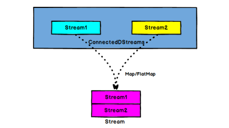

#  Flink 学习笔记

## 初识Flink

Flink起源于Stratosphere项目，Stratosphere是在2010~2014年由3所地处柏林的大学和欧洲的一些其他的大学共同进行的研究项目，2014年4月Stratosphere代码被复制并捐赠给了Apache软件基金会，参加这个孵化项目的初始成员是Stratosphere系统的核心开发人员，2014年12月，Flink一跃成为Apache软件基金会的顶级项目。

在德语中，Flink一词表示快速和灵巧，项目采用一只松鼠的彩色图案作为logo，这不仅是因为松鼠具有快速和灵巧的特点，还因为柏林的松鼠有一种迷人的红棕色，而 Flink 的松鼠logo拥有可爱的尾巴，尾巴的颜色与 Apache 软件基金会的 logo 颜色相呼应，也就是说，这是一只Apache风格的松鼠。

Flink 项目的理念是：“Apache Flink 是为分布式、高性能、随时可用以及准确的流处理应用程序打造的开源流处理框架”。Apache Flink 是一个框架和分布式处理引擎，用于对无界和有界数据流进行有状态计算。Flink 被设计在所有常见的集群环境中运行，以内存执行速度和任意规模来执行计算

-------------------------------------------------

## Flink 流处理Api

### 1. Source
#### 1.1 从集合读取数据
~~~ java
// 创建执行环境
StreamExecutionEnvironment env=StreamExecutionEnvironment.getExecutuionEnvironment();
// 从集合读取数据
DataStream<T> inputStream=env.fromCollection(Array.asList(new T(),new T(),new T()));

DataStream<Integer> integer = env.fromElements(1,2,3,4,5);
~~~
#### 1.2 从文件读取数据
~~~ java
// 创建执行环境
StreamExecutionEnvironment env=StreamExecutionEnvironment.getExecutuionEnvironment();
// 从文件读取数据
DataStream<String> inputStream=env.readTextFile("filePath");

DataStream<Integer> integer = env.readFile("filePath");
~~~

#### 1.3 从消息队列读取数据（kafka）
~~~ java
// 创建执行环境
StreamExecutionEnvironment env=StreamExecutionEnvironment.getExecutuionEnvironment();
// 从kafka读取数据
DataStream<String> inputStream=env.addSource(new FilnkKafkaConsumer())

DataStream<Integer> integer = env.readFile("filePath");
~~~

#### 1.4 自定义source
~~~ java
// 创建执行环境
StreamExecutionEnvironment env=StreamExecutionEnvironment.getExecutuionEnvironment();
// 从自定义source读取数据
DataStream<String> inputStream=env.addSource(new MySource())

//自定义source 
public static MySource() implements SourceFunction<T>{

    private runFlag=true;

    @Override
    public void run(SourceContext<T> ctx){
        while(runFlag){
            //生成自定义数据
            ctx.collect(new T);
        }

    }

    @Override
    public void cnacel(){
        runFlag=false;
    }
}
~~~

### 2. TransForm

#### 2.1 map 

~~~ java
// 输出字符串的长度
inputStream.map(new MapFunction<String,Integer>(){
    @Override
    public Integer map(String value){
        retunt value.length();
    }
});
~~~
#### 2.2 flatMap
~~~ java
// 按逗号分字段
inputStream.flatMap(new flatMapFunction<String,String>(){
    @Override
    public void flatMap(String value,Collector<String> out){
        for(String filed:value.split(",")){
            out.collect(filed);
        }
    }
});
~~~
#### 2.3 filter

~~~ java
// 筛选值大于三的数据
inputStream.filter(new filterFunction<Integer>(){
    @Override
    public boolen filter(Integer value){
        returm value > 3;
    }
});
~~~

#### 2.4 KeyBy

DataStream → KeyedStream：逻辑地将一个流拆分成不相交的分区，每个分
区包含具有相同 key 的元素，在内部以 hash 的形式实现的。

~~~ java
KeyedStream<T,Tuple> keyedStream= dataStream.keyBy("id");
KeyedStream<T,String> keyedStream= dataStream.keyBy(p->p.getId());

~~~

#### 2.5 滚动聚合算子
下面这些算子可以针对 KeyedStream 的每一个支流做聚合
* sum()
* min()
* max()
* minBy()
* maxBy()
  
~~~ java
DataStream<T> resultStream = keyedStream.max("temperature");
DataStream<T> resultStream = keyedStream.maxBy("temperature");
resultStream.print();
//max和maxBy的区别是  举例说明：以下是输入数据
SensorReading ss=new SensorReading("sensor_1", 1547718199L, 35.8);
new SensorReading("sensor_6", 1547718201L, 15.4);
new SensorReading("sensor_1", 1547718200L, 36.8);
new SensorReading("sensor_1", 1547718213L, 37.8);
new SensorReading("sensor_7", 1547718202L, 6.7);
new SensorReading("sensor_10", 1547718205L, 38.1);
//max结果是
new SensorReading("sensor_1", 1547718199L, 35.8);
new SensorReading("sensor_6", 1547718201L, 15.4);
new SensorReading("sensor_1", 1547718199L, 36.8);
new SensorReading("sensor_1", 1547718199L, 37.8);
new SensorReading("sensor_7", 1547718202L, 6.7);
new SensorReading("sensor_10", 1547718205L, 38.1);
//maxBy结果是
new SensorReading("sensor_1", 1547718199L, 35.8);
new SensorReading("sensor_6", 1547718201L, 15.4);
new SensorReading("sensor_1", 1547718200L, 36.8);
new SensorReading("sensor_1", 1547718213L, 37.8);
new SensorReading("sensor_7", 1547718202L, 6.7);
new SensorReading("sensor_10", 1547718205L, 38.1);
~~~

#### 2.6 Reduce
KeyedStream → DataStream：一个分组数据流的聚合操作，合并当前的元素
和上次聚合的结果，产生一个新的值，返回的流中包含每一次聚合的结果，而不是
只返回最后一次聚合的最终结果。

~~~ java
DataStream<String> inputStream = env.readTextFile("sensor.txt");
 // 转换成 SensorReading 类型
DataStream<SensorReading> dataStream = inputStream.map(new
    MapFunction<String, SensorReading>() {
        public SensorReading map(String value) throws Exception {
        String[] fileds = value.split(",");
        return new SensorReading(fileds[0], new Long(fileds[1]), new Double(fileds[2]));
    }
 });
 // 分组
 KeyedStream<SensorReading, Tuple> keyedStream = dataStream.keyBy("id");
 // reduce 聚合，取最小的温度值，并输出当前的时间戳
 DataStream<SensorReading> reduceStream = keyedStream.reduce(new
    ReduceFunction<SensorReading>() {
        // value1 是之前计算的值（flink有状态计算），value2是最新的传感器数据
        @Override
        public SensorReading reduce(SensorReading value1, SensorReading value2) throws Exception {
                return new SensorReading(value1.getId(),value2.getTimestamp(),Math.min(value1.getTemperature(), value2.getTemperature()));
    }
 });
~~~

#### 2.7 Split 和 Select

**split**

DataStream → SplitStream：根据某些特征把一个 DataStream 拆分成两个或者多个 DataStream。

**select**

SplitStream→DataStream：从一个 SplitStream 中获取一个或者多个DataStream。

需求：传感器数据按照温度高低（以 30 度为界），拆分成两个流。
~~~ java
SplitStream<SensorReading> splitStream = dataStream.split(new
OutputSelector<SensorReading>() {
 @Override
 public Iterable<String> select(SensorReading value) {
 return (value.getTemperature() > 30) ? Collections.singletonList("high") :
Collections.singletonList("low");
 }
});
DataStream<SensorReading> highTempStream = splitStream.select("high");
DataStream<SensorReading> lowTempStream = splitStream.select("low");
DataStream<SensorReading> allTempStream = splitStream.select("high", "low");
~~~

#### 2.8 Connect 和 CoMap

**connect**

DataStream,DataStream → ConnectedStreams：连接两个保持他们类型的数据流，两个数据流被 Connect 之后，只是被放在了一个同一个流中，内部依然保持各自的数据和形式不发生任何变化，两个流相互独立。

**comap  coflatMap**

ConnectedStreams → DataStream：作用于 ConnectedStreams 上，功能与 map和 flatMap 一样，对 ConnectedStreams 中的每一个 Stream 分别进行map 和 flatMap处理。

~~~ java
DataStream<Tuple2<String, Double>> warningStream = highTempStream.map(new
MapFunction<SensorReading, Tuple2<String, Double>>() {
 @Override
 public Tuple2<String, Double> map(SensorReading value) throws Exception {
 return new Tuple2<>(value.getId(), value.getTemperature());
 }
});
ConnectedStreams<Tuple2<String, Double>, SensorReading> connectedStreams = warningStream.connect(lowTempStream);
DataStream<Object> resultStream = connectedStreams.map(new
CoMapFunction<Tuple2<String,Double>, SensorReading, Object>() {
 @Override
 public Object map1(Tuple2<String, Double> value) throws Exception {
 return new Tuple3<>(value.f0, value.f1, "warning");
 }
 @Override
 public Object map2(SensorReading value) throws Exception {
 return new Tuple2<>(value.getId(), "healthy");
 }
});
~~~

#### 2.9 union

DataStream → DataStream：对两个或者两个以上的 DataStream 进行 union 操作，产生一个包含所有 DataStream 元素的新 DataStream。

~~~ java
DataStream<SensorReading> unionStream = highTempStream.union(lowTempStream);
~~~

Connect 与 Union 区别:
* Union 之前两个流的类型必须是一样，Connect 可以不一样，在之后的 coMap
中再去调整成为一样的。
* Connect 只能操作两个流，Union 可以操作多个。

### 3. 支持的数据类型

Flink 流应用程序处理的是以数据对象表示的事件流。所以在 Flink 内部，我们需要能够处理这些对象。它们需要被序列化和反序列化，以便通过网络传送它们；或者从状态后端、检查点和保存点读取它们。为了有效地做到这一点，Flink 需要明确知道应用程序所处理的数据类型。Flink 使用类型信息的概念来表示数据类型，并为每个数据类型生成特定的序列化器、反序列化器和比较器。Flink 还具有一个类型提取系统，该系统分析函数的输入和返回类型，以自动获取类型信息，从而获得序列化器和反序列化器。但是，在某些情况下，例如 lambda函数或泛型类型，需要显式地提供类型信息，才能使应用程序正常工作或提高其性能。

Flink 支持 Java 和 Scala 中所有常见数据类型。使用最广泛的类型有以下几种。

#### 3.1 基础数据类型

~~~ java
DataStream<Integer> numberStream = env.fromElements(1, 2, 3, 4);
numberStream.map(data -> data * 2);
~~~

#### 3.2 Java 和 Scala 元组（Tuples）

~~~ java
DataStream<Tuple2<String, Integer>> personStream = env.fromElements(
 new Tuple2("Adam", 17),
 new Tuple2("Sarah", 23) );
personStream.filter(p -> p.f1 > 18);
~~~
#### 3.3 Scala 样例类（case classes）
~~~ scala
case class Person(name: String, age: Int)
val persons: DataStream[Person] = env.fromElements(
Person("Adam", 17),
Person("Sarah", 23) )
persons.filter(p => p.age > 18)
~~~

#### 3.4 Java 简单对象（POJOs）
~~~ java
public class Person {
public String name;
public int age;
 public Person() {}
 public Person(String name, int age) { 
this.name = name; 
this.age = age; 
}
}
DataStream<Person> persons = env.fromElements( 
new Person("Alex", 42), 
new Person("Wendy", 23));
~~~

#### 3.5  其它（Arrays, Lists, Maps, Enums, 等等）

Flink 对 Java 和 Scala 中的一些特殊目的的类型也都是支持的，比如 Java 的ArrayList，HashMap，Enum 等等。

### 4 . 实现 UDF 函数——更细粒度的控制流

#### 4.1 实现 UDF 函数——更细粒度的控制

Flink 暴露了所有 udf 函数的接口(实现方式为接口或者抽象类)。例如
MapFunction, FilterFunction, ProcessFunction 等等。
下面例子实现了 FilterFunction 接口：

~~~ java
DataStream<String> flinkTweets = tweets.filter(new FlinkFilter());
public static class FlinkFilter implements FilterFunction<String> {
 @Override
 public boolean filter(String value) throws Exception {
 return value.contains("flink");
    }
}
~~~

还可以将函数实现成匿名类
~~~ java
DataStream<String> flinkTweets = tweets.filter(new FilterFunction<String>() {
 @Override
 public boolean filter(String value) throws Exception {
 return value.contains("flink");
 }
});
~~~
我们 filter 的字符串"flink"还可以当作参数传进去。
~~~ java
DataStream<String> tweets = env.readTextFile("INPUT_FILE ");
DataStream<String> flinkTweets = tweets.filter(new KeyWordFilter("flink"));
public static class KeyWordFilter implements FilterFunction<String> {
 private String keyWord;
 KeyWordFilter(String keyWord) { this.keyWord = keyWord; }
 @Override
 public boolean filter(String value) throws Exception {
 return value.contains(this.keyWord);
 }
}

~~~

#### 4.2  匿名函数（Lambda Functions）

~~~ java
DataStream<String> tweets = env.readTextFile("INPUT_FILE");
DataStream<String> flinkTweets = tweets.filter( tweet -> tweet.contains("flink") );

~~~

#### 4.3 富函数（Rich Functions）

“富函数”是 DataStream API 提供的一个函数类的接口，所有 Flink 函数类都有其 Rich 版本。它与常规函数的不同在于，可以获取运行环境的上下文，并拥有一些生命周期方法，所以可以实现更复杂的功能。(后面会讲状态编程)
* RichMapFunction
* RichFlatMapFunction
* RichFilterFunction
* …
  

Rich Function 有一个生命周期的概念。典型的生命周期方法有：
* open()方法是 rich function 的初始化方法，当一个算子例如 map 或者 filter被调用之前 open()会被调用。
* close()方法是生命周期中的最后一个调用的方法，做一些清理工作。
* getRuntimeContext()方法提供了函数的 RuntimeContext 的一些信息，例如函数执行的并行度，任务的名字，以及 state 状态

~~~java
public static class MyMapFunction extends RichMapFunction<SensorReading, Tuple2<Integer, String>> {
 @Override
 public Tuple2<Integer, String> map(SensorReading value) throws Exception {
        return new Tuple2<>(getRuntimeContext().getIndexOfThisSubtask(), value.getId());
    }
 @Override
 public void open(Configuration parameters) throws Exception {
     System.out.println("my map open");
    // 以下可以做一些初始化工作，例如建立一个和 HDFS 的连接（每个分区执行一次）
    }
 @Override
 public void close() throws Exception {
    System.out.println("my map close");
 // 以下做一些清理工作，例如断开和 HDFS 的连接（每个分区执行一次）
    }
}

~~~

### 5. Sink
